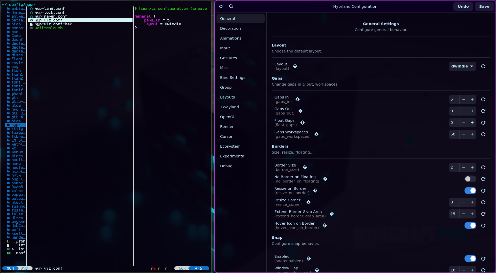

<div align='center'>


<h2>HyprViz</h2>

[](https://github.com/timasoft/hyprviz/actions)
[](https://github.com/timasoft/hyprviz/actions)
[](https://github.com/hyprwm/Hyprland)

**Fork** of [HyprGUI](https://github.com/MarkusVolk/hyprgui) — an unofficial GUI for configuring Hyprland, built with GTK4 and Rust. 🚀🦀<br>
Comes with a custom [hyprparser](https://crates.io/crates/hyprparser) for Hyprland's configuration file. (Rust btw) 🦀

> **Note:** Hyprland 0.52 is not supported yet.



</div>

## Installation

[](https://repology.org/project/hyprviz)

### Arch Linux
There are 2 different [AUR](https://aur.archlinux.org) packages available:

- [hyprviz](https://aur.archlinux.org/packages/hyprviz) - Latest release built from source
- [hyprviz-bin](https://aur.archlinux.org/packages/hyprviz-bin) - Latest release in binary form

Install the preferred package with:
```bash
git clone https://aur.archlinux.org/<package>.git
cd <package>
makepkg -si
```

Or, if you're using an [AUR Helper](https://wiki.archlinux.org/title/AUR_helpers), it's even simpler (using [paru](https://github.com/Morganamilo/paru) as an example):
```bash
paru -S <package>
```

### NixOS
This project is packaged in multiple ways for Nix:

#### From nixpkgs
HyprViz is available in nixpkgs unstable. Recommended installation methods:

For temporary usage:
```bash
nix run nixpkgs#hyprviz
```

For system-wide installation in your NixOS configuration:
```nix
{
  environment.systemPackages = with pkgs; [
    hyprviz
  ];
}
```

#### From GitHub flake
Alternatively, you can use the GitHub flake directly.
Make sure you have flakes enabled in Nix.

You can run **hyprviz** directly with:
```bash
nix run github:timasoft/hyprviz
```

If you want to have hyprviz always available in your $PATH:
```bash
nix profile install github:timasoft/hyprviz
```

If you manage your NixOS configuration with flakes, add hyprviz as an input in your flake.nix:
```nix
{
  inputs.hyprviz.url = "github:timasoft/hyprviz";

  outputs = { self, nixpkgs, hyprviz, ... }:
    {
      nixosConfigurations.my-hostname = nixpkgs.lib.nixosSystem {
        system = "x86_64-linux";
        modules = [
          ./configuration.nix
          {
            environment.systemPackages = [
              hyprviz.packages.x86_64-linux.default
            ];
          }
        ];
      };
    };
}
```

## Building from source
1. Install Rust (preferably `rustup`) through your distro's package or [the official script](https://www.rust-lang.org/tools/install)
2. Install `git`, `pango` and `gtk4`
3. Clone this repository:
`git clone https://github.com/timasoft/hyprviz.git && cd hyprviz`
4. Compile the app with `cargo build --release` or run it directly with `cargo run --release`

## TODO:
- [x] Improve value parser
- [x] Improve colour options
- [x] Create aur repo
- [x] Add default values
- [x] Add support for sourced files
- [x] Update preview
- [x] Add dropdown_int and bool_int
- [x] Add ability to create and switch between custom profiles
- [x] Add system info section
- [x] Add bind section
- [x] Add windowrule section
- [x] Add other top-level config sections from Hyprland
- [x] Add guides to top-level sections
- [x] Add guides to some other sections
- [x] Add hyprviz to nixpkgs
- [x] Add i18n
- [ ] Add curve editor
- [ ] Add symlink support
- [ ] Add support for waybar, swaync, hyprlock...
- [ ] Improve GUI

## Credits:
- [Nyx](https://github.com/nnyyxxxx) - Implementing the parser, rest of the main GUI, and maintaining the hyprgui project
- [Adam](https://github.com/adamperkowski) - Implementing the base GUI, maintaining the AUR packages and the project alongside Nyx
- [Vaxry](https://github.com/vaxerski) - Hyprland
- [rust-gtk](https://github.com/gtk-rs/gtk4-rs) - The GTK4 library
- [Hyprland](https://github.com/hyprwm/Hyprland) - The window manager
